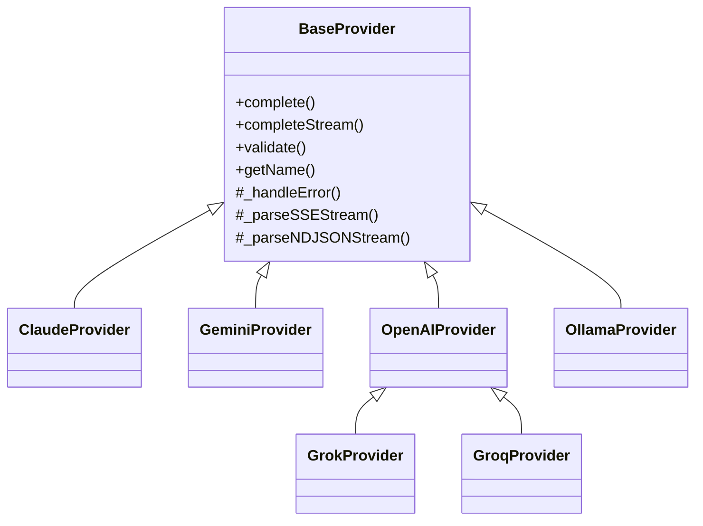

# AI Sidebar

  
  
  
  

Chrome extension that injects a context-aware AI assistant sidebar into any webpage, routing prompts to one of six AI providers with streaming responses.

---

## Features

- **Six AI providers** — Claude, Gemini, OpenAI, Grok, Groq, and Ollama; selected at runtime via `ProviderFactory`
- **OOP provider hierarchy** — `BaseProvider` abstract class with concrete subclasses; `GrokProvider` and `GroqProvider` extend `OpenAIProvider` by passing a different `baseUrl` to `super()`
- **MV3 Service Worker** — handles `Alt+A` keyboard command, context menu registration, and live `VALIDATE_KEY` requests with a 10-second `Promise.race` timeout
- **Cross-origin `postMessage` security** — sidebar iframe validates `event.source === window.parent` before accepting any message; user-supplied text is always set via `textContent`, never `innerHTML`
- **Page content extraction** — `extractPageContent()` walks semantic selectors (`article`, `main`, `[role="main"]`, `.article-body`, `.post-content`, etc.), strips `<script>`, `<style>`, `<nav>`, `<header>`, `<footer>`, and `[aria-hidden]` nodes, then truncates at 12,000 characters
- **Live API key validation** — settings page sends a `VALIDATE_KEY` message to the service worker, which instantiates the provider class and calls `validate()` against the real API
- **Custom Markdown-to-HTML renderer** — hand-rolled `renderMarkdown()` handles headings, bold/italic, inline and fenced code, tables, ordered and unordered lists, and links; output is passed through a DOM-based allowlist sanitizer (`sanitizeHTML()`) before insertion

---

## Architecture

`ProviderFactory.get(name, apiKeys, selectedModels)` applies the Strategy pattern — the sidebar calls `provider.completeStream()` with no knowledge of which class is running. `GrokProvider` and `GroqProvider` are one-liners that pass a different `baseUrl` to `super()`, reusing the entire `OpenAIProvider` implementation. Switching providers requires only a single `chrome.storage.sync` write.

---

## Providers

| Provider | Class | Default model | Additional models |
|---|---|---|---|
| Claude (Anthropic) | `ClaudeProvider` | `claude-sonnet-4-6` | `claude-haiku-4-5-20251001`, `claude-opus-4-7` |
| Gemini (Google) | `GeminiProvider` | `gemini-2.0-flash` | `gemini-1.5-flash`, `gemini-1.5-pro`, `gemini-2.5-pro` |
| OpenAI | `OpenAIProvider` | `gpt-4o-mini` | `gpt-4o`, `o4-mini` |
| Grok (xAI) | `GrokProvider` extends `OpenAIProvider` | `grok-3-mini` | `grok-3` |
| Groq | `GroqProvider` extends `OpenAIProvider` | `llama-3.3-70b-versatile` | `llama-3.1-8b-instant`, `gemma2-9b-it` |
| Ollama (local) | `OllamaProvider` | `llama3.2` | any locally pulled model |

---

## Install

1. Clone or download this repository.
2. Open `chrome://extensions`.
3. Enable **Developer mode** (toggle, top-right).
4. Click **Load unpacked** and select the `ai-sidebar` folder.

> No build step required — plain HTML, CSS, and JS.
